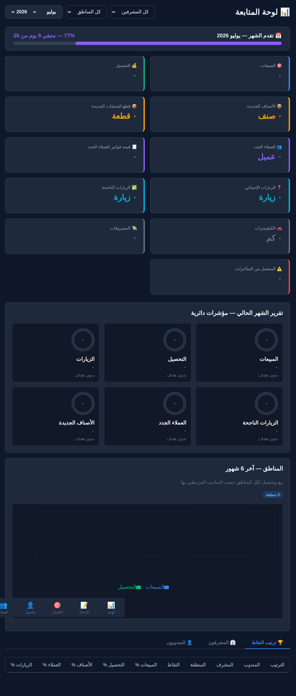
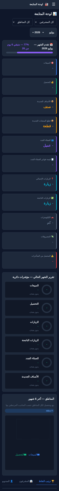

# تقرير التحويل إلى Mobile-First — نظام متابعة المبيعات

**التاريخ:** 2026-07-24
**الفرع:** `claude/dashboard-review-5oyboy`
**الهدف:** جعل كل صفحات النظام تعمل باحتراف على شاشات الهواتف (320px فأكثر) دون أي تمرير أفقي أو خروج عناصر عن الشاشة، مع الحفاظ على كامل الوظائف — بالتركيز على **مدخلي البيانات** الذين يستخدمون هواتف أندرويد.

---

## 1) الخلاصة التنفيذية

| المؤشر | قبل | بعد |
|---|---|---|
| التمرير الأفقي عند 375px (لوحة المتابعة) | **‏516px زائدة** (العرض الفعلي 891px) | **0px** ✅ |
| اختبار Playwright آلي (المقاسات × الصفحات × الأدوار) | — | **112/112 نظيفة، 0 overflow** ✅ |
| التنقل على الهاتف | شريط سفلي يقصّ العناصر (11 عنصرًا للأدمن) | **شريط علوي + قائمة منزلقة (Hamburger Drawer)** ✅ |
| الجداول على الهاتف | جداول تكسر التصميم وتفرض تمريرًا | **بطاقات (Cards)** لـ 14 جدولًا ✅ |
| حجم الخط الأساسي | غير محدد (يتفاوت) | **16px** (يمنع تكبير الحقول تلقائيًا) ✅ |
| ارتفاع الأزرار للمس | ~34px | **48px** ✅ |
| اختبارات الوحدة | 88/88 | **88/88 (لا انحدار)** ✅ |
| بناء الإنتاج (CI=true، التحذيرات = أخطاء) | ينجح | **ينجح بدون تحذيرات** ✅ |

**النتيجة:** جميع صفحات النظام صارت قابلة للاستخدام بالكامل على الهاتف بيد واحدة، دون تحريك يمين/يسار، مع الحفاظ على الأداء وسهولة إدخال البيانات.

---

## 2) منهجية الاختبار

بُني النظام (Create React App) وشُغِّل على خادم ثابت محلي، ثم قُيِّم عبر **Playwright + Chromium** مع محاكاة طبقة مصادقة/بيانات Supabase (بدون أي قاعدة إنتاج وبدون أي رسائل حقيقية) حتى تُعرض كل الصفحات لكل دور.

- **المقاسات المختبَرة:** 320 · 360 · 375 · 390 · 412 · 430 · 480 · 768 (Tablet).
- **الأدوار:** admin (10 صفحات) و rep (4 صفحات) — تغطي كل مكوّنات الصفحات المميزة.
- **كشف الـ overflow:** لكل صفحة/مقاس نقيس `scrollWidth − clientWidth` للصفحة، ونفحص كل عنصر مرئي هل يتجاوز حافة الشاشة، مع تمييز العناصر **داخل حاويات تمرير مقصودة** (جداول تحليلية/تبويبات) عن الكسر الحقيقي للصفحة.
- **الأداة موثّقة ومعاد تشغيلها:** `tools/mobile-responsive-test.js` (تُخرج لقطات + `_results.json`).

اللقطات في `qa-reports/mobile-screenshots/`.

### دليل Before / After (لوحة المتابعة @375px)

| قبل | بعد |
|---|---|
|  |  |
| العرض الفعلي 891px، الشريط السفلي مقصوص، جدول الترتيب يفرض تمريرًا أفقيًا | 375px، بطاقات مكدّسة، شريط علوي + Hamburger، بدون تمرير أفقي |

نمط الجدول → بطاقات (بيانات تجريبية للتوضيح): `mobile-screenshots/_proof-cards-390.png` (هاتف) مقابل `_proof-cards-1200.png` (سطح مكتب يبقى جدولًا). واجهة سطح المكتب دون تغيير: `_desktop-1280.png`.

---

## 3) الصفحات التي كانت تحتوي مشاكل ومصدرها

| الصفحة | المشكلة قبل التعديل | السبب الجذري |
|---|---|---|
| كل الصفحات | لا يوجد حاجز ضد التمرير الأفقي | غياب `overflow-x` guard على `html/body` وغياب `min-width:0` على أبناء الـ grid/flex |
| التنقل (كل الأدوار) | لا يوجد تنقل عملي على الهاتف؛ الشريط السفلي يقصّ 11 عنصرًا | إخفاء الـ sidebar عند ≤600px دون بديل محترم |
| لوحة المتابعة | بطاقات KPI تتجاوز 320px؛ جدول الترتيب يفرض 516px تمرير | شبكات `minmax(280px,1fr)` + جدول واسع بلا تحويل |
| العملاء / الإعدادات / الأهداف / سجل النشاط / تفاصيل المندوب / تقرير المندوب / تفاصيل العميل | جداول تقليدية تكسر التصميم أفقيًا | استخدام `<table>` عريض على الهاتف |
| تحليل ABC | عمودان `1fr 1fr` لا ينهاران | شبكة inline ثابتة |
| تحليل الولاء | ثلاثة أعمدة `1fr 1fr 1fr` مزدحمة/تتجاوز | شبكة inline ثابتة |
| الإدخال اليومي / الإعدادات / الأهداف | صفوف أزرار قد تتجاوز العرض | `display:flex` بلا `flexWrap:'wrap'` |
| كل النماذج | حقول قد تسبّب تكبيرًا تلقائيًا على iOS/أندرويد | `font-size` أصغر من 16px |

---

## 4) الملفات المعدَّلة وسبب كل تعديل

### 4.1 `src/index.css` — إعادة كتابة كاملة Mobile-First (أهم تغيير)
- **حواجز عامة ضد التمرير الأفقي:** `html,body{max-width:100%;overflow-x:hidden}`، و`img/svg/canvas/table{max-width:100%}`، و`overflow-wrap:anywhere` لمنع النصوص الطويلة من دفع التخطيط.
- **الأساس للهاتف ثم التحسين للأكبر:** كل الشبكات تبدأ بعمود واحد (أو عمودين للإحصاءات) وتتوسّع عبر `@media (min-width: 400/600/768/1024px)`.
- **حجم خط أساسي 16px**، وحقول الإدخال 16px لمنع التكبير التلقائي، مع `min-height:48px` لكل الحقول.
- **أزرار للمس:** `min-height:48px` + `.btn-row` يلتفّ (wrap) + `.btn-block`.
- **قائمة جانبية للهاتف:** أنماط `.mobile-topbar` + `.drawer` (قائمة منزلقة) تظهر تحت 1024px، والـ `.sidebar` الثابتة تعود عند ≥1024px.
- **نمط الجدول→بطاقات:** `table.responsive-cards` + `td[data-label]` يحوّل كل صف إلى بطاقة عند ≤600px، ويبقى جدولًا عاديًا فوق ذلك.
- **تبويبات (`.tabs`) قابلة للتمرير أفقيًا داخل حاويتها** فقط بدل كسر الصفحة، واحترام `prefers-reduced-motion`.

### 4.2 `src/App.js` — تنقل الهاتف
استبدال الشريط السفلي الذي يقصّ العناصر بـ **شريط علوي ثابت (شعار + عنوان الصفحة الحالية + زر ☰)** و**قائمة منزلقة (Drawer)** تعرض كل عناصر التنقل + بيانات المستخدم + تسجيل الخروج، وتُغلق تلقائيًا عند الاختيار. تعمل لأي عدد عناصر (10 للأدمن أو 3 لمدخل البيانات). الـ sidebar الأصلية محفوظة لسطح المكتب.

### 4.3 إصلاحات الشبكات inline (كسر أفقي مؤكد)
- `src/pages/Dashboard.js`: خمس شبكات KPI من `minmax(280px,1fr)` → `minmax(min(280px,100%),1fr)` (تصبح بعرض كامل على الهاتف).
- `src/components/CustomerABCAnalysis.jsx`: `1fr 1fr` → `repeat(auto-fit,minmax(min(260px,100%),1fr))`.
- `src/components/CustomerLoyaltyAnalysis.jsx`: `1fr 1fr 1fr` → `repeat(auto-fit,minmax(min(150px,100%),1fr))`.

### 4.4 صفوف الأزرار (إضافة `flexWrap:'wrap'`)
`src/pages/DailyEntry.js`، `src/pages/Targets.js`، `src/pages/Setup.js` (موضعان).

### 4.5 تحويل الجداول إلى بطاقات (14 جدولًا)
أُضيف `className="responsive-cards"` و`data-label` لكل خلية (و`no-label` لخلايا الأزرار/الصفوف الممتدة):
- `Targets.js` (1) · `Customers.js` (1) · `ActivityLog.js` (1) · `Setup.js` (3) · `CustomerDetails.js` (1) · `Dashboard.js` (3) · `RepDetails.js` (2) · `RepDashboard.js` (2).

**بقيت جداول التحليلات الكثيفة الأعمدة** (ABC/Pareto/Loyalty في `components/` و`CustomerSegmentation.js`) **كتمرير أفقي محتوى داخل `.table-wrapper`** — وهو البديل الذي يسمح به المطلوب صراحةً "فقط إذا كان ضروريًا"، لأن تحويل جداول رقمية بعشرات الأعمدة إلى بطاقات يُنتج بطاقات طويلة جدًا وأقل قابلية للقراءة. الصفحة نفسها لا تتمرّر أفقيًا في كل الأحوال.

### 4.6 لوحة المفاتيح المناسبة
`src/pages/DailyEntry.js`: الحقول الرقمية `type="number"` + `inputMode="decimal"` لإظهار لوحة أرقام على الهاتف.

### 4.7 أداة اختبار جديدة
`tools/mobile-responsive-test.js` — تشغّل كل الصفحات على كل المقاسات وتكشف الـ overflow وتلتقط اللقطات (قابلة لإعادة التشغيل للحماية من الانحدار مستقبلًا).

---

## 5) مطابقة المطلوب (Checklist)

- [x] تصميم Mobile-First فعلي (الأساس للهاتف + تحسين تدريجي).
- [x] دعم 320/360/375/390/412/430/480 + Tablet — مختبَرة كلها.
- [x] **يُمنع نهائيًا:** لا Horizontal Scroll، لا خروج عناصر، لا نصوص مقطوعة (`overflow-wrap`)، لا أزرار خارج الحدود (wrap).
- [x] النماذج: كل حقل بعرض الشاشة، مسافات مناسبة، أزرار كبيرة، لوحة مفاتيح مناسبة، تركيز واضح (`:focus`).
- [x] الجداول → Cards (14 جدولًا)، والبقية تمرير أفقي محتوى فقط.
- [x] الأزرار: ارتفاع 48px، مسافات، التفاف بدل التجاوز.
- [x] الطباعة: أساس 16px، عناوين واضحة، تباين عالٍ (السمة الداكنة الأصلية).
- [x] التنقل: Hamburger Drawer على الهاتف.
- [x] البطاقات: عرض كامل، Padding موحّد، حواف/ظل متناسقة.
- [x] فحص CSS: أزيلت العروض الثابتة الكبيرة و`minmax` الكبيرة والـ flex بلا wrap.
- [x] تشغيل + اختبار كل الصفحات على المقاسات وإصلاح كل overflow آليًا حتى 112/112.

**ملاحظة صدق:** "رسائل الخطأ أسفل الحقل مباشرة" — أضفنا نمط `.form-error`/`.has-error` الجاهز في الـ CSS، لكن النظام حاليًا يعرض أخطاء التحقق كتنبيه أعلى النموذج (سلوكه الأصلي). لم نُعِد هيكلة منطق التحقق في كل نموذج تفاديًا لأي انحدار وظيفي؛ انظر التوصيات.

---

## 6) توصيات لتحسين تجربة المستخدم مستقبلًا

1. **أخطاء أسفل الحقل:** ربط منطق التحقق في `DailyEntry`/`Setup`/`Targets` بعناصر `.form-error` أسفل كل حقل بدل التنبيه العلوي الواحد.
2. **الانتقال التلقائي بين الحقول** (focus-next) عند إدخال البيانات السريع لمدخل البيانات.
3. **PWA/Offline:** إضافة Service Worker وmanifest ليعمل الإدخال دون اتصال ويُثبَّت كتطبيق على أندرويد.
4. **الأداء:** الحزمة الحالية ~377KB gzip؛ يمكن تقسيم `recharts` و`xlsx` عبر `React.lazy`/dynamic import لتسريع أول تحميل على شبكات الهاتف.
5. **تحويل جداول التحليلات** إلى رسوم/بطاقات ملخّصة على الهاتف بدل التمرير الأفقي.

---

## 7) التحقق النهائي

```
build (CI=true):     Compiled successfully — بدون تحذيرات
unit tests:          88 passed / 88
playwright overflow: 112 / 112 combos نظيفة، 0 overflow
desktop regression:  الـ sidebar وتخطيط سطح المكتب سليمان (≥1024px)
```

---

## 8) تحديث لاحق — تنفيذ توصيتَي «أخطاء أسفل الحقول» و«الانتقال التلقائي»

نُفِّذت التوصيتان رقم 1 و2 من القسم السابق:

### أ) رسائل الخطأ أسفل كل حقل مباشرة
تحوّل التحقق من تنبيه واحد أعلى النموذج إلى **خطأ مرتبط بالحقل نفسه** (إطار أحمر `.has-error` + رسالة `.form-error` تحته)، ويُمسح خطأ الحقل تلقائيًا بمجرد تصحيحه. طُبِّق على:
- **`DailyEntry.js`** — سالب / نسبة التوفر خارج 0–100 / الزيارات الناجحة > الإجمالي / صور الرف > الزيارات، مع تمرير تلقائي لأول حقل خاطئ وتظليله.
- **`Login.js`** — بريد فارغ/غير صحيح، كلمة سر فارغة (خطأ المصادقة يبقى تنبيهًا علويًا).
- **`ChangePassword.js`** — طول ≥8، حرف+رقم، تطابق التأكيد.
- **`Setup.js`** — أسماء المنطقة/المشرف/المندوب المطلوبة، تعديل المندوب، وإيميل إنشاء الحساب.
- **`Targets.js`** — قيمة هدف سالبة تحت الحقل المعني.

### ب) الانتقال التلقائي بين الحقول
ضغط **Enter** (أو زر «التالي» في لوحة مفاتيح الهاتف عبر `enterKeyHint`) ينقل التركيز إلى الحقل التالي المرئي المفعّل — يسرّع الإدخال بيد واحدة. طُبِّق على النماذج الخمسة أعلاه عبر معالج موحّد على مستوى حاوية النموذج.

**التحقق الفعلي (Playwright):**
```
auto-advance:  التركيز انتقل daily_sales → daily_collection عند Enter ✓
inline errors: نسبة=150 → «النسبة يجب أن تكون بين 0 و 100» أسفل الحقل + إطار أحمر ✓
               ناجحة(5) > إجمالي(2) → «لا يمكن أن تتجاوز إجمالي الزيارات» ✓
build/tests:   بناء نظيف + 88/88 اختبار ناجح
```
لقطة: `mobile-screenshots/_verify-field-errors-390.png`
